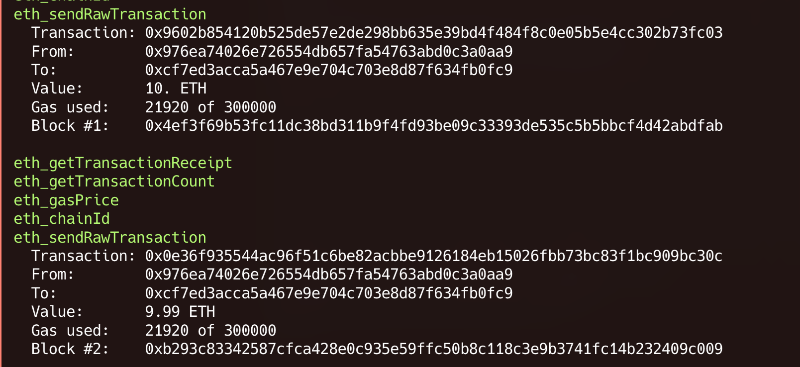

### What is Credloom?

### Architecture of the application

#### ML model Sample:

To Trigger the Model, A sample command is shown below(change the URL to localhost or wherever it is being hosted):

```
curl -X POST https://localhost:5000/predict \
  -H "Content-Type: application/json" \
  -d '{
    "total_transactions": 100,
    "num_previous_loans": 2,
    "total_previous_loans_eth": 1.5,
    "holding_days": 30,
    "Tier": 1
  }'

```

**OUTPUT:**

```
JSON output: {"ai_risk_score":654,"risk_raw":0.3454290484630654}
```

#### Blockchain Transactions sample:



_Remaining Transactions can be fetched using the mentioned endpoints in_ **blochain-service**

#### Frontend Output Screenshots:
